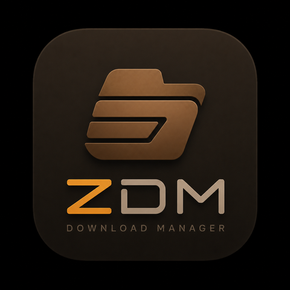

<div align="center">



# ZDM

**A fast, segmented download manager for Windows, macOS, and Linux.**

[](https://github.com/thisisroot/zdm/actions/workflows/build.yml)
[](LICENSE)
[](#download)

[Download](#download) · [Features](#features) · [Architecture](#architecture) · [Development](#development) · [Contributing](#contributing)

</div>

---

ZDM splits every download across multiple connections and pulls them all at
once, so total throughput isn't capped by a single connection's speed. Chunks
are drawn from a shared work queue rather than fixed per-connection ranges, so
a fast connection naturally picks up more work than a slow one instead of
idling once its share is done. Progress in the UI reflects that reality
directly — each connection's real position and speed, not a simulated bar.

## Features

- **Multi-connection segmented downloads** — splits files into chunks pulled
  by N concurrent connections for maximum throughput
- **Genuine per-connection progress** — the UI shows exactly what each active
  connection is doing, straight from the engine's own telemetry
- **Resumable transfers** — survive an app restart, a lost connection, or a
  manual pause, and continue from where they left off
- **Queues** — group downloads together with their own concurrency limit and
  bulk pause/resume
- **Batch downloading** — expand a numbered URL pattern into a full queue of
  files in one step
- **Auto-categorized folders** — new downloads are sorted into the right
  folder by file type automatically
- **Native and lightweight** — a Rust core with a small, fast desktop shell;
  no bundled browser runtime

## Download

Grab the latest installer for your platform from the
**[Releases page](https://github.com/thisisroot/zdm/releases)**:

| Platform | Format |
| --- | --- |
| Windows | `.exe` (NSIS) / `.msi` |
| macOS | `.dmg` |
| Linux | `.deb`, `.rpm`, or AppImage |

> Builds are currently unsigned. On Windows, SmartScreen shows a warning on
> first launch — choose "More info → Run anyway". On macOS, Gatekeeper will
> refuse to open the app and say it's "damaged" — this isn't corruption, it's
> Gatekeeper rejecting an unsigned, un-notarized app; clear the quarantine flag
> it's downloaded with by running this in Terminal after moving ZDM to
> Applications, then open it normally:
> ```
> xattr -cr /Applications/ZDM.app
> ```

## Architecture

ZDM is a [Tauri](https://tauri.app) app: a Rust backend with a native OS
webview for the UI, rather than a bundled browser runtime.

```
crates/zdm-core/   The download engine — pure Rust, no GUI dependency
src-tauri/         The Tauri backend — app state, queue scheduler, SQLite
src/               The React + TypeScript UI
```

- **`crates/zdm-core`** probes a URL for range support, splits the file into
  small chunks, and hands them out to N concurrent workers pulling from a
  shared queue. It persists enough state (`<file>.zdm.json`) to resume after
  a restart, and validates the remote hasn't changed (via ETag/Last-Modified)
  before trusting old progress. It has its own test suite that runs against a
  real local HTTP server — no mocked network layer.
- **`src-tauri`** turns engine events into app-level `DownloadRecord`s, runs
  the queue scheduler (which downloads get a connection slot), persists
  history/queues/settings to a local SQLite database, and exposes commands to
  the frontend.
- **`src`** is the UI: React, TypeScript, and hand-rolled CSS design tokens —
  no component framework, so every pixel matches the app's own visual
  identity rather than a generic design system's defaults.

## Development

```sh
git clone https://github.com/thisisroot/zdm.git
cd zdm
npm install
npm run tauri dev
```

### Platform prerequisites

<details>
<summary><b>Windows</b></summary>

- [Rust](https://rustup.rs) (MSVC toolchain — the default `rustup` install)
- [Node.js](https://nodejs.org) 20+
- [Visual Studio Build Tools](https://visualstudio.microsoft.com/downloads/) with the "Desktop development with C++" workload
- WebView2 Runtime (preinstalled on Windows 10/11; Tauri prompts to install it otherwise)

</details>

<details>
<summary><b>macOS</b></summary>

- [Rust](https://rustup.rs)
- [Node.js](https://nodejs.org) 20+
- Xcode Command Line Tools (`xcode-select --install`)

</details>

<details>
<summary><b>Linux (Debian/Ubuntu)</b></summary>

```sh
sudo apt update
sudo apt install libwebkit2gtk-4.1-dev build-essential curl wget file \
  libxdo-dev libssl-dev libayatana-appindicator3-dev librsvg2-dev pkg-config libdbus-1-dev
```

</details>

### Building an installer

```sh
npm run tauri build
```

Produces a native installer for whichever OS you run it on (NSIS/MSI on
Windows, `.dmg` on macOS, `.deb`/`.rpm`/AppImage on Linux).

### Testing

```sh
cargo test --workspace   # Rust: engine + backend
npx tsc -b               # TypeScript typecheck
```

## Contributing

Issues and pull requests are welcome. For anything nontrivial, please open an
issue first to discuss the approach before sending a PR.

## License

MIT — see [LICENSE](LICENSE).
